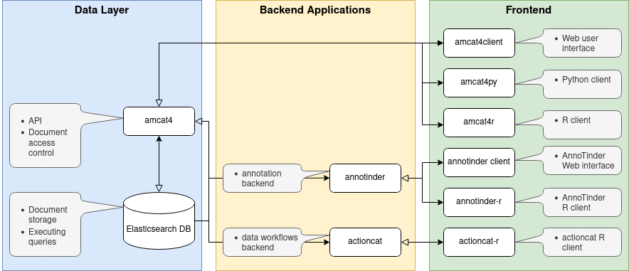
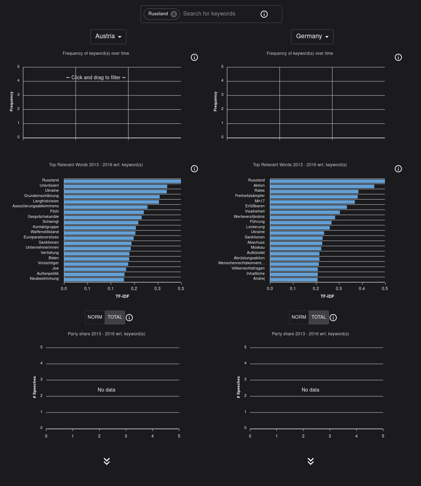
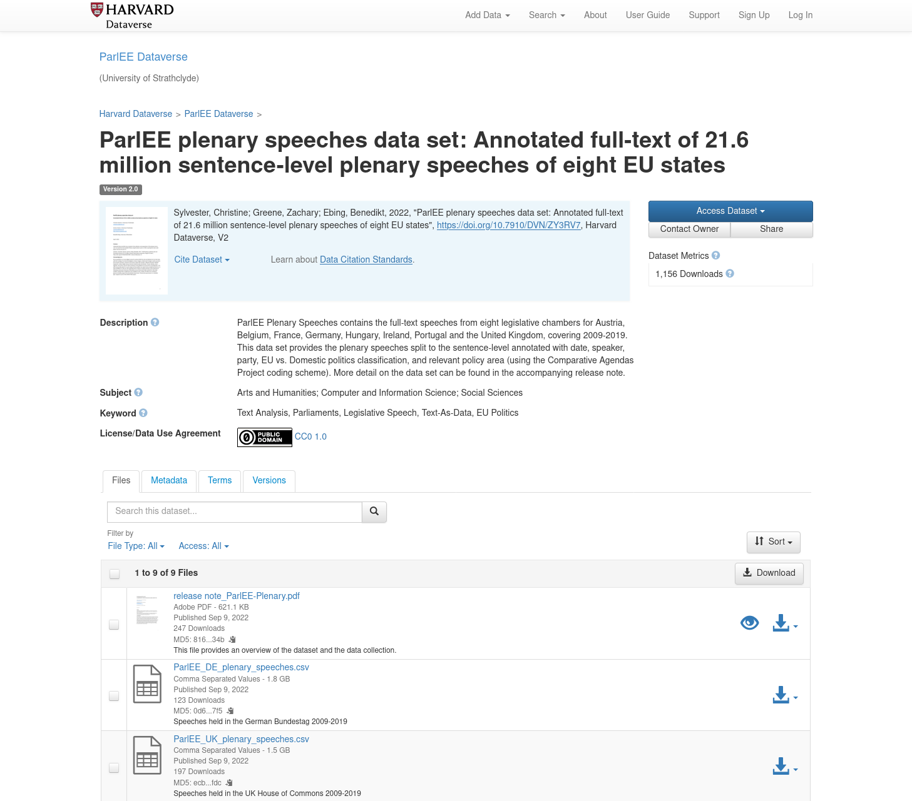
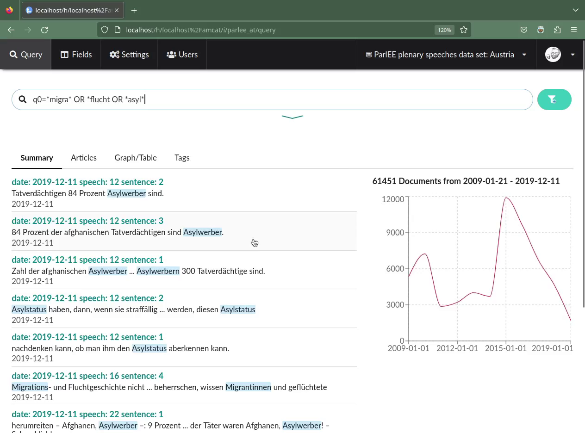
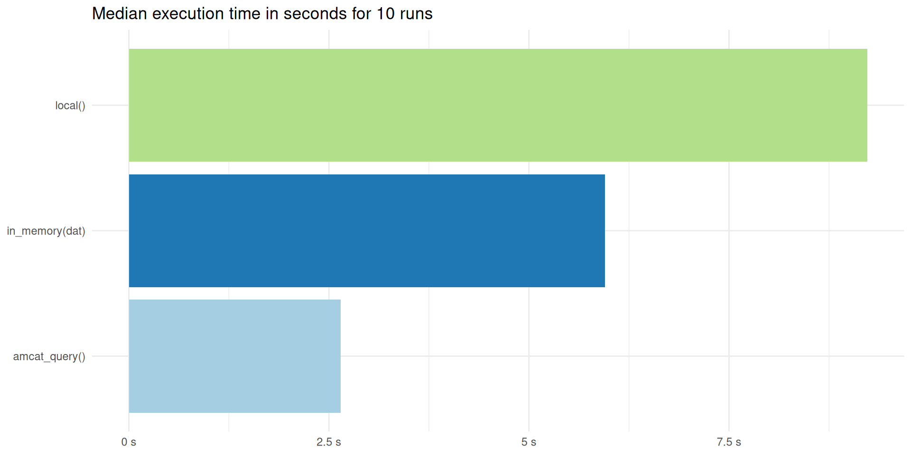
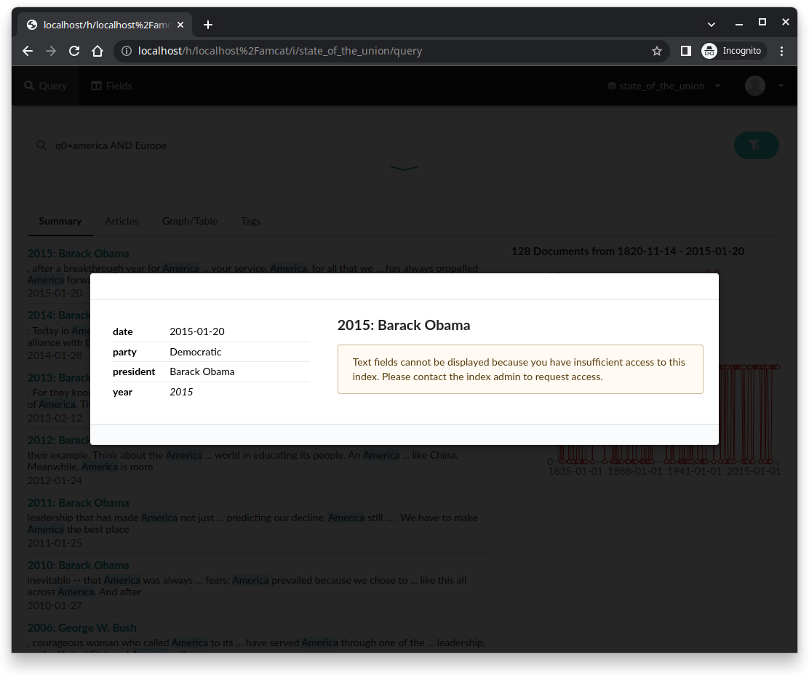

# Summary

The Amsterdam Content Analysis Toolkit (AmCAT) has been in development in various guises since about 2001 as a text research / content analysis platform.
The core of the project has always been a database of documents, combined with graphical user interface and API to make it possible for casual and power users respectively to quickly gather the texts they need.
In the current fourth iteration of the toolkit, a particular focus was put on sharing data online, while access is being managed with a flexible set of user roles.
We developed this toolkit based on a modular design and open source frameworks, focused on the needs we identified for ourselves and the text-as-data community.
\autoref{fig:design} shows the parts of the toolkit, which consists of a data layer that contains the storage, optional back-end applications that can be used to annotate or pre-process data, and the user facing frontend, which allows access via a graphical user interface or API clients for `R`and `Python`.
The modular design means that parts of the toolkit may be included in existing or custom infrastructure.
For example, \autoref{fig:dashboard} shows an alternative interface developed on top of AmCAT to efficiently compare text collections.^[<https://parliaments.opted.eu/dashboard>.]





## AmCAT: not just for storage

Currently one of the most used options for sharing corpora is the (Harvard) Dataverse.
It allows researchers to archive data sets for free and obtain a Digital Object Identifier (DOI), which makes them easily citable.
However, while it allows researchers to upload a readme and description document to introduce the data, there is no way to explore a data set before downloading it.
For most data sets, this is no problem as data files are only a few megabytes at most.
Typical text corpora, like the ParlEE data set [@ParlEE2022] shown in \autoref{fig:parlee}, contain several gigabytes and take minutes or sometimes hours to download.
And compared to this minor nuisance, it constitutes a problem when a dataset is not publicly available, but the data owners' permission must be requested for a new researcher instead or a set of, e.g., URLs, must be rehydrated^[Scraped or requested from an API again.] before using the data is possible.



### User interface

In AmCAT, it is instead possible to easily explore data before committing to it.
\autoref{fig:migra_parlee} shows the ParlEE data set [@ParlEE2022] once again, but this time the data is filtered for speeches in the Austrian parliament that feature a term connected to migration. 
The example shows that there is a stark increase in mentions of the terms in 2015, which is probably interesting researchers focused on the migration debate.
Queries are made in *Elasticsearch*'s "mini-language" for query strings, which is widely used and [well documented](https://web.archive.org/web/20230827002715/https://www.elastic.co/guide/en/elasticsearch/reference/current/query-dsl-query-string-query.html).



### API

Besides the web interface, we offer a fully featured REST API and API wrapper packages for `R` and `Python`.
We also include OpenAPI specifications in the default installation, which makes it easy to develop other wrappers.
The API has the same search, upload, download, and data modification capabilities as the web interface.
Below, we reproduce the search from \autoref{fig:migra_parlee} inside `R`:

```r
library(tidyverse)
library(amcat4r)
amcat_login("https://opted.amcat.nl/amcat") # publicly available server
query_documents("parlee", # name of the index
                # search string (uses only in text column)
                queries = "text:migra* OR text:flucht* OR text:asyl*", 
                # include all fields
                fields = NULL,
                # only search in Austrian corpus
                filters	= list(iso3country = "AUS"), 
                per_page = 10000, 
                page = NULL, # retrieve all pages
                max_pages = Inf) |> 
  # visualisation using ggplot2
  count(date) |>
  ggplot(aes(x = date, y = n)) +
  geom_line()
```

The API makes AmCAT a valuable asset for power users and enables them to include data in their reproduction materials.
API commands can also be used to in a script for larger-than-memory data, as chunks of the data can be processed one by one instead of loading the whole data into memory first.


### Benchmarks

We built AmCAT on top of *Elasticsearch*.
The main advantages of this search engine are that queries are executed extremely fast and advanced queries, including Boolean operators and wildcards, can be employed.^[
We recognize that *Elasticsearch*'s current licence is not considered open-source, but we sympathize with [the reasons behind the change](https://web.archive.org/web/20230811152832/https://www.zdnet.com/article/elastic-changes-open-source-license-to-monetize-cloud-service-use/) and do not expect any impact on the users of our toolkit. It is also possible to use an older version of *Elasticsearch* that is fully open-source (i.e., below version *Elasticsearch* v7.11).]
\autoref{fig:bench} shows the time it takes to execute the query above using a function that:

- reads in a single `csv` file from ParlEE (local) [@ParlEE2022]
- only filters this data when it is already in memory (memory)
- queries a local instance of AmCAT using a filter and search string as above (amcat_query_local)
- does the same, but with a remote instance (amcat_query_remote)



Making the request through AmCAT takes only half the time compared to filtering using `dplyr` and less than a third compared to reading in the `csv` file first.
The full benchmark script can be found in our companion repository.

## Flexible Access control

An important feature of AmCAT is that it allows for fine-grained access control and *non-consumptive* research -- analyses that use computational methods, while the researcher can not consume (i.e., read) the text.
We accomplish this with a set of instance and index roles that allow the admin users to grant or revoke access of indices (i.e., text collections), fields (columns) and the AmCAT instance.
What makes this special is that users can be granted access to only to metadata of a text data set.
For the queries an searches a user can perform, this makes little difference.
Only when they try to read a text, they are presented with the message in \autoref{fig:metareader}.



This setup allows for *non-consumptive* research similar to the functions of *Google Book*, where researchers can check if a corpus contains relevant data before working towards getting access.
We extend these capabilities by providing a framework to package arbirtraty workflows that can then be run on an AmCAT instance.

Using `actioncat`, users can write a script in `R`, `Python` or another language, package it into a Docker container and send a Docker Compose file to the administrator of a server to check if it conforms with theor policies on data access.
Doing so enables researchers to perform, for example, destructive pre-processing of text (i.e., where the original text can not be restored).
In this way, a corpus can still be used for essentially every text-as-data analysis pipeline imaginable, without running risk of violating copyrights or the privacy of data  owners.
We provide two example workflows, one that uses `R` to turn text into a document-feature-matrix, one that uses  `Python` turn the text into document embeddings.

To authenticate users, we wrote our own authentication provider called `middlecat`.
Unlike in previous iterations, this completely omits passwords in favor of connecting to identity providers like Github, ORCID, or Google or one-time login links.
The advantage is that we can follow a parsimonious approach to user privacy (besides email addresses, we keep no user data) while still making sure that the user is actually who they claim.

## Installation and Documentation

All different parts of AmCAT are available on GitHub:

- `amcat4`: <https://github.com/ccs-amsterdam/amcat4>
- `amcat4actioncat`: <https://github.com/ccs-amsterdam/amcat4actioncat>
- `amcat4client`: <https://github.com/ccs-amsterdam/amcat4client>
- `amcat4py`: <https://github.com/ccs-amsterdam/amcat4py>
- `amcat4r`: <https://github.com/ccs-amsterdam/amcat4r>
- `middlecat`: <https://github.com/ccs-amsterdam/middlecat>

The individual repositories contain instructions to install the packages.
We also provide a more comprehensive manual at <amcat.nl/book/>, which covers installation, workflows, user management and so on.

We recommend to install AmCAT through the open-source application Docker.
In our [`amcat4docker`](https://github.com/ccs-amsterdam/amcat4docker) repository, we provide several Docker Compose files that make it possible to get a full AmCAT instance running in minutes with no other dependecies than Docker itself.

# Statement of need

Sharing a collection of text data with other researchers comes with slightly different needs than sharing, for example, a survey data set.
Researchers who want to use a data set for secondary analysis might want to explore it first to see if it contains relevant data;
they might then want to filter said data set using keywords or search queries;
text data nowadays come with limitations for re-distribution connected to copyright or privacy concerns, making alternative distribution avenues (such as only sharing metadata or pre-processed versions of text) necessary.
Current infrastructure for sharing data, such as the Dataverse, were not built with these needs in mind, as they do not generally apply to the much smaller data sets that, for example, survey researchers use.
In the current iteration of the *Amsterdam Content Analysis Toolkit* (AmCAT), we focused on filling these needs of the text-as-data community.
In a time when access to data becomes more difficult due to APIs of social media platforms being shut down and media outlets starting to defend themselves more rigorously against scraping, the importance of sharing corpora for secondary analysis has suddenly surged.
With the infrastructure software we present here, we hope to encourage the research community to embrace more widespread sharing of text data.


# Acknowledgements

The current iteration of AmCAT was developed with funding from the [OPTED](https://opted.eu/) (*Observatory for Political Texts in European Democracies*) ERC Infrastructure project.

# References
